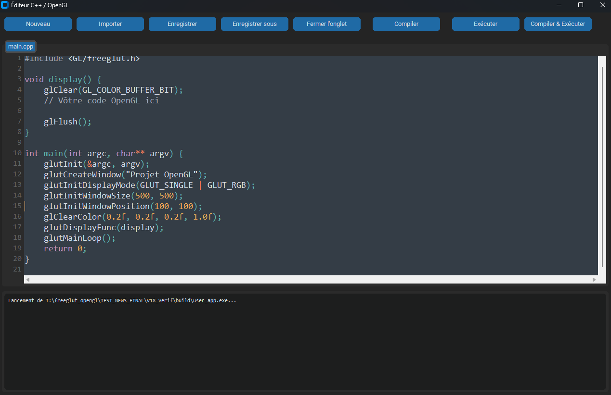

# Starter Kit OpenGL & FreeGLUT

*This boilerplate is designed to help students easily use FreeGLUT with OpenGL, and it is fully functional on both Windows and Linux.*

Ce projet est un kit de démarrage prêt à l'emploi conçu pour les étudiants du **[Master 1 EEA de l'Université de Montpellier](https://www.umontpellier.fr/)** 🇫🇷. Son objectif est de fournir un environnement de développement C++ avec OpenGL et FreeGLUT fonctionnel en quelques minutes, sans installation manuelle complexe et sans dépendre de Visual Studio.


## Fonctionnalités



*   **Environnement Portable :** Tous les outils (compilateur, CMake, Conan) sont téléchargés dans le projet. Aucune installation globale n'est nécessaire.
*   **Cross-Platform :** Scripts d'installation et d'exécution pour Windows (`.bat`) et Linux (`.sh`).
*   **Compilation et Exécution Simplifiées :** Des scripts dédiés gèrent la compilation et le lancement de votre code OpenGL.
*   **Interface Intuitive :** Une interface utilisateur inspirée des éditeurs modernes comme VS Code, incluant :
    *   Gestion de la sauvegarde de fichiers.
    *   Système d'onglets pour naviguer entre plusieurs fichiers.
    *   Visualisation des logs de compilation et d'exécution.

## Prérequis

*   **Système d'exploitation :**
    *   Windows 10 / 11
    *   Linux (Ubuntu, Debian ou distributions similaires recommandées)
*   **Architecture :** x86_64 (64-bit)
*   **Connexion Internet :** Requise pour le premier lancement afin de télécharger les dépendances.

## Installation

L'installation est entièrement automatisée. Vous n'avez besoin de l'exécuter **qu'une seule fois**.

#### Pour Windows

Double-cliquez et exécutez le script `setup.bat`. Il se chargera de télécharger le compilateur, les outils et les bibliothèques nécessaires.

```shell
.\setup.bat
```

#### Pour Linux

Vous devez d'abord rendre les scripts exécutables, puis lancer le script d'installation.

```bash
# Rendre les scripts exécutables (à ne faire qu'une seule fois)
chmod +x setup.sh
chmod +x run.sh

# Lancer l'installation
./setup.sh
```

## Utilisation

Une fois l'installation terminée, utilisez le script `run` correspondant à votre système pour compiler et lancer l'application.

*   **Sur Windows :** `run.bat`
*   **Sur Linux :** `./run.sh`

## Remerciements

Ce projet n'existerait pas sans les incroyables outils et bibliothèques développés par la communauté open-source. Un grand merci aux équipes derrière :

*   **[FreeGLUT](http://freeglut.sourceforge.net/)** : Pour cette alternative open-source à la bibliothèque GLUT.
*   **[OpenGL](https://www.opengl.org/)** : Le standard de l'industrie pour les graphismes 2D/3D.
*   **[Conan](https://conan.io/)** : Pour la gestion simplifiée des dépendances C++.
*   **[CMake](https://cmake.org/)** : Pour le système de build cross-platform robuste.
*   **[MinGW-w64](https://www.mingw-w64.org/)** : Pour fournir une version récente du compilateur GCC sur Windows (builds par [niXman](https://github.com/niXman/mingw-builds-binaries/)).
*   **[uv](https://github.com/astral-sh/uv)** : Pour la gestion ultra-rapide des environnements et paquets Python.

## Licence

Ce projet est distribué sous la **Licence Apache 2.0**. Pour plus de détails, consultez le fichier `LICENSE` inclus dans le dépôt.